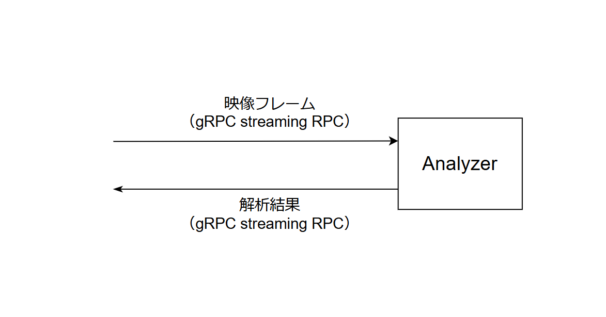

動画解析機（Analyzer）のリファレンス実装
--------------------------

## 解析処理の実装

AIソリューションプラットフォーム上で稼働するAnalyzerはgRPCサーバーとして動作します。
開発者は、事前に定義されているプロトコル定義ファイル（.proto）に従って
AnalyzerのgRPCインターフェースを実装する必要があります。



本リファレンス実装は、動画解析用のAnalyzerをPythonで実装したものです。`analyzer/main.py`に解析のメインの実装を記述しており、開発者はこのメインコードを編集して開発することで、gRPCの実装やH.264動画コーデックについての深い知識がなくとも、所望の解析を実装可能です。詳細は、`analyzer/main.py`のコード内のコメントを参照ください。

## Analyzerのローカルでの起動

### 環境条件
- python 3.10.x 以上
- uv
- ffmpeg

デフォルトでは、python3.14が指定されています。バージョンを変更する場合は、`.python-version`ファイルを編集してください。

### 事前準備

必要なPythonパッケージをインストールします。
```sh
$ uv sync --group dev
```

※ M1 Macでは以下のように環境変数 `GRPC_PYTHON_BUILD_SYSTEM_OPENSSL=1` および `GRPC_PYTHON_BUILD_SYSTEM_ZLIB=1` を指定してください。
```sh
$ export GRPC_PYTHON_BUILD_SYSTEM_OPENSSL=1
$ export GRPC_PYTHON_BUILD_SYSTEM_ZLIB=1
$ uv sync --group dev
```

protoファイルおよびgrpcio-toolsに更新がある場合は、以下を実行します。
```sh
$ uv run python -m grpc_tools.protoc \
    --proto_path=. \
    --python_out=. \
    --grpc_python_out=. \
    --mypy_out=. \
    proto/stream/v1/analyzer.proto
```

### Analyzerの起動
Analyzerをローカル環境で起動します。
```sh
$ uv run python -m analyzer.main
server listening at [::]:50051
```

### Analyzerの動作確認
`tools/stream_analyzer_client.py` に、Analyzerに対してgRPCリクエストを送信するためのクライアントツールを用意しています。引数に実際の動画データを渡すことで、解析処理の結果確認やパラメータチューニングなどが実施できます。以下のように実行します。
```sh
$ uv run python -m tools.stream_analyzer_client --device-id sample-device --in-filename samples/xxxx.mp4 -re
```

動画フレームの時刻を固定したい場合は、以下のように`--base-timestamp`オプションを指定します。
```sh
$ uv run python -m tools.stream_analyzer_client --in-filename samples/xxxx.mp4 --base-timestamp "2025-01-01T00:00:00Z" -re
```

特定の`user_config`、`developer_config`が指定された場合の動作を確認する場合は、以下のようにJSONファイルを指定します。
```sh
$ uv run python -m tools.stream_analyzer_client --in-filename samples/xxxx.mp4 --user-config samples/user_config.json --developer-config samples/developer_config.json --geometry-config samples/geometry_config.json
```

特定の`context`を指定して動作を確認する場合は、以下のように`--context`オプションを指定します。
user_configやdeveloper_configを更新するとセッションが再接続されるため、引き継ぎたい情報があればデバイスコンテキストで出力すれば次のセッションでも情報が引き継がれます。
この引き継がれる情報(最後の通知時間など)を`--context`に設定します。
```sh
$ uv run python -m tools.stream_analyzer_client --in-filename samples/xxxx.mp4 --context samples/context.json
```


### Dockerイメージファイルの作成
AIソリューションプラットフォーム上にAnalyzerを登録するためには、実装したAnalyzerをtar.gz形式のDockerイメージファイルを作成する必要があります。Dockerイメージファイルは以下のように作成します。
```sh
$ docker build -t sample-stream-analyzer .
$ docker save sample-stream-analyzer | gzip > sample-stream-analyzer.tar.gz
```

正常終了すると、`sample-stream-analyzer.tar.gz`という名前でDockerイメージファイルが生成されます。この生成されたtar.gz形式ファイルをAIソリューションプラットフォーム上に登録します。


### formatterの適用
ruffを使用したフォーマットのチェックと適用を行います

```sh
$ uv run ruff check analyzer/ tools/
$ uv run ruff format analyzer/ tools/
```
